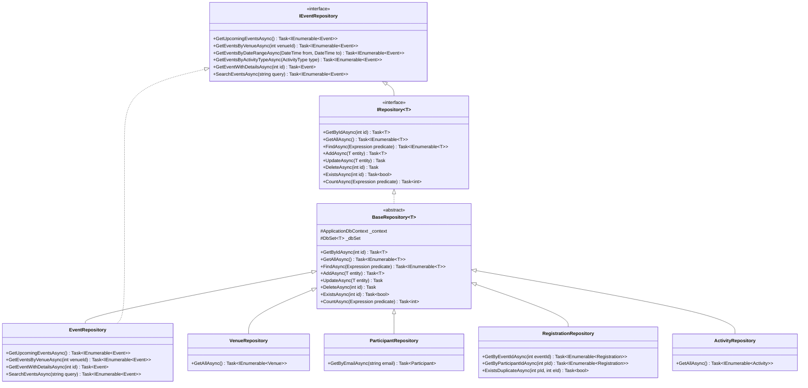
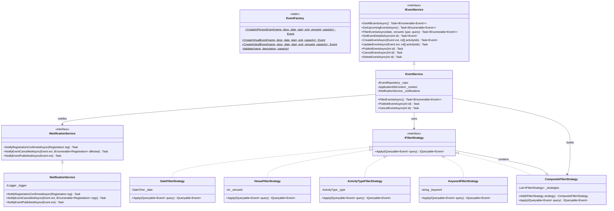
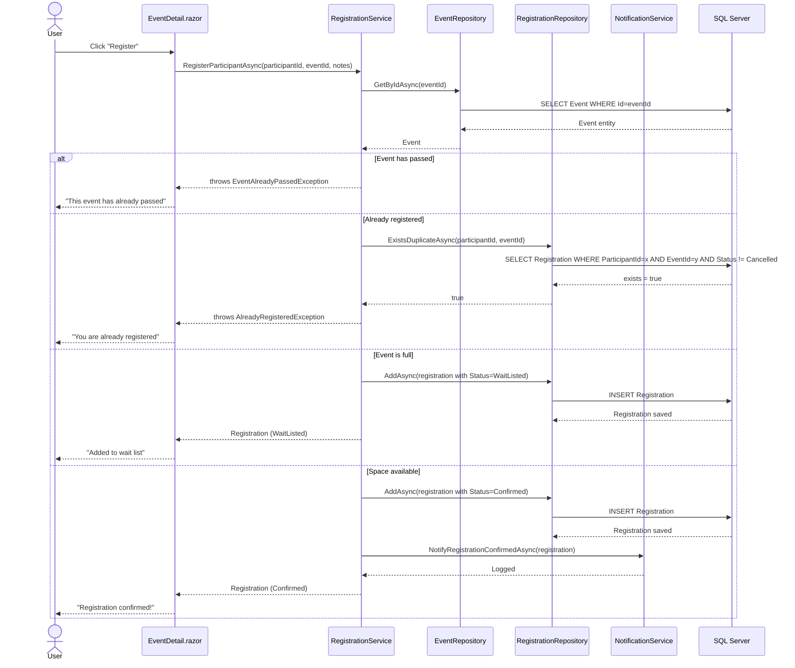
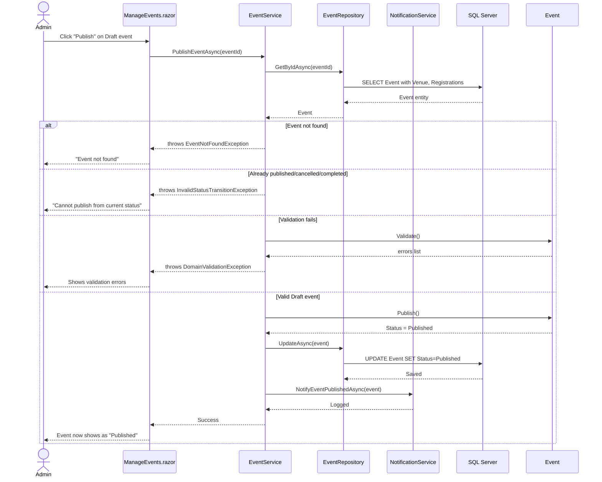
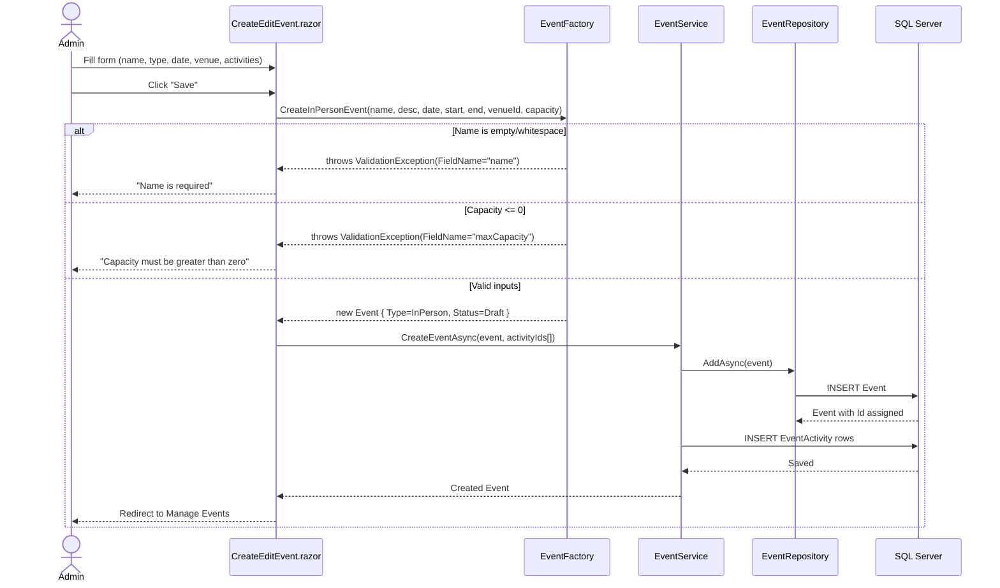
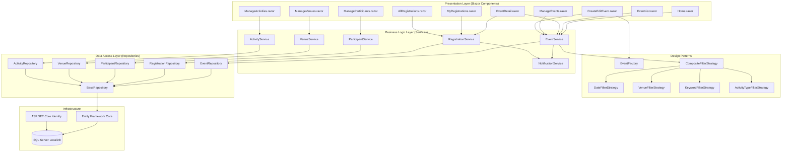
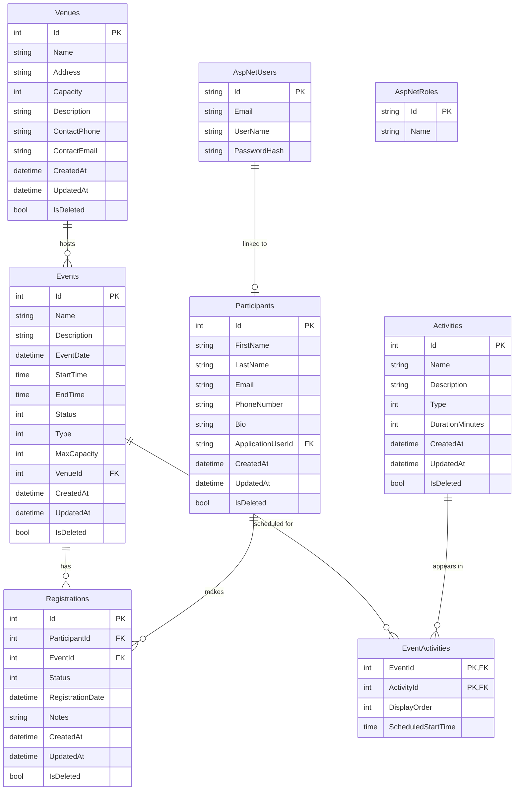

# Community Event Management System — UML Diagrams

## 1. Class Diagram — Full System Architecture

```mermaid
classDiagram
    %% ─── ABSTRACT BASE ───────────────────────────────────────────
    class BaseEntity {
        <<abstract>>
        -DateTime _createdAt
        -DateTime _updatedAt
        +int Id
        +DateTime CreatedAt
        +DateTime UpdatedAt
        +bool IsDeleted
        +string DisplayName*
        +IEnumerable~string~ Validate()*
        +bool IsValid()
        +void SoftDelete()
        +string ToString()
    }

    %% ─── DOMAIN MODELS ───────────────────────────────────────────
    class Event {
        -DateTime _eventDate
        -int _maxCapacity
        +string Name
        +string Description
        +DateTime EventDate
        +TimeSpan StartTime
        +TimeSpan EndTime
        +EventStatus Status
        +EventType Type
        +int MaxCapacity
        +int? VenueId
        +int ConfirmedRegistrationCount
        +int AvailableSpots
        +bool IsFull
        +bool HasPassed
        +bool IsUpcoming
        +string DisplayName
        +IEnumerable~string~ Validate()
        +void Publish()
        +void Cancel()
        +void MarkCompleted()
    }

    class Venue {
        +string Name
        +string Address
        +int Capacity
        +string Description
        +string ContactPhone
        +string ContactEmail
        +string DisplayName
        +IEnumerable~string~ Validate()
        +bool CanAccommodate(int attendeeCount)
    }

    class Participant {
        -string _email
        +string FirstName
        +string LastName
        +string Email
        +string PhoneNumber
        +string Bio
        +string ApplicationUserId
        +string FullName
        +string DisplayName
        +IEnumerable~string~ Validate()
    }

    class Activity {
        +string Name
        +string Description
        +ActivityType Type
        +int DurationMinutes
        +string DisplayName
        +IEnumerable~string~ Validate()
    }

    class Registration {
        +int ParticipantId
        +int EventId
        +RegistrationStatus Status
        +DateTime RegistrationDate
        +string Notes
        +string DisplayName
        +IEnumerable~string~ Validate()
        +void Confirm()
        +void Cancel()
        +void WaitList()
    }

    class EventActivity {
        +int EventId
        +int ActivityId
        +int DisplayOrder
        +TimeSpan? ScheduledStartTime
    }

    %% ─── ENUMS ───────────────────────────────────────────────────
    class EventStatus {
        <<enumeration>>
        Draft
        Published
        Cancelled
        Completed
    }

    class EventType {
        <<enumeration>>
        InPerson
        Virtual
        Hybrid
    }

    class RegistrationStatus {
        <<enumeration>>
        Pending
        Confirmed
        Cancelled
        WaitListed
    }

    class ActivityType {
        <<enumeration>>
        Workshop
        Talk
        Game
        Performance
        Networking
        Exhibition
        Other
    }

    %% ─── INHERITANCE ─────────────────────────────────────────────
    BaseEntity <|-- Event
    BaseEntity <|-- Venue
    BaseEntity <|-- Participant
    BaseEntity <|-- Activity
    BaseEntity <|-- Registration

    %% ─── ASSOCIATIONS ────────────────────────────────────────────
    Event "many" --> "1" Venue : held at
    Event "1" --> "many" Registration : has
    Event "1" --> "many" EventActivity : contains
    Activity "1" --> "many" EventActivity : featured in
    Participant "1" --> "many" Registration : makes

    %% ─── EXCEPTIONS ──────────────────────────────────────────────
    class AppException {
        +string ErrorCode
        +string Message
    }
    class ValidationException {
        +string FieldName
        +string Reason
        +ErrorCode: VALIDATION_ERROR
    }
    class DomainValidationException {
        +IEnumerable~string~ Errors
    }
    class NotFoundException {
        +ErrorCode: NOT_FOUND
    }
    class EventNotFoundException
    class ParticipantNotFoundException
    class VenueNotFoundException
    class RegistrationNotFoundException
    class BusinessRuleException
    class EventCapacityExceededException
    class AlreadyRegisteredException
    class EventAlreadyPassedException
    class InvalidStatusTransitionException
    class DuplicateEntityException {
        +ErrorCode: DUPLICATE_ENTITY
    }

    AppException <|-- ValidationException
    AppException <|-- DomainValidationException
    AppException <|-- NotFoundException
    AppException <|-- BusinessRuleException
    AppException <|-- DuplicateEntityException
    NotFoundException <|-- EventNotFoundException
    NotFoundException <|-- ParticipantNotFoundException
    NotFoundException <|-- VenueNotFoundException
    NotFoundException <|-- RegistrationNotFoundException
    BusinessRuleException <|-- EventCapacityExceededException
    BusinessRuleException <|-- AlreadyRegisteredException
    BusinessRuleException <|-- EventAlreadyPassedException
    BusinessRuleException <|-- InvalidStatusTransitionException
```

---

## 2. Class Diagram — Repository Layer (Repository Pattern)

---

## 3. Class Diagram — Service + Strategy + Factory + Observer Patterns

---

## 4. Sequence Diagram — User Registers for an Event

---

## 5. Sequence Diagram — Admin Publishes an Event

---

## 6. Sequence Diagram — Admin Creates Event via Factory

---

## 7. Component Diagram — Application Architecture

---

## 8. Entity Relationship Diagram (Database Schema)

